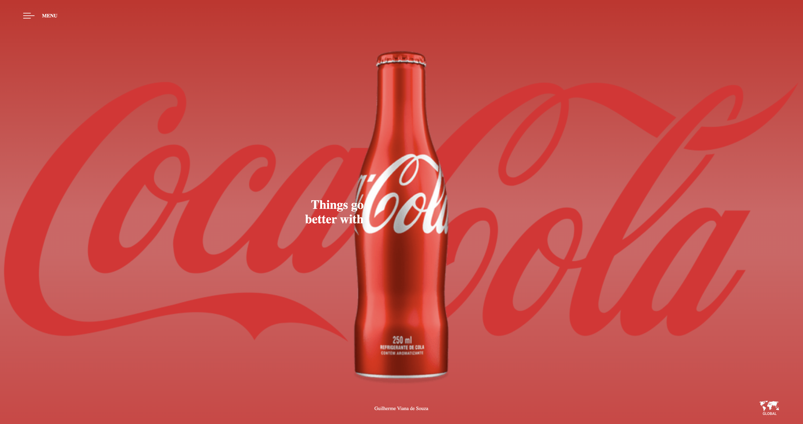

# COCA-COLA

Primeiro website criado, do tipo landing page, para treino no desensolvimento de sites.
O site foi desenvolvido utilizando boas práticas, como por exemplo tags semânticas e responsividade.
Adicionando uma nova página ao website, adicionado um link que redirecionando para outra página

## Tecnologias
* HTML
* CSS
* Medias Queries

## Autor
[Guilherme Viana de Souza] (<https://www.linkedin.com/in/guilherme-viana-a2a671320/>)